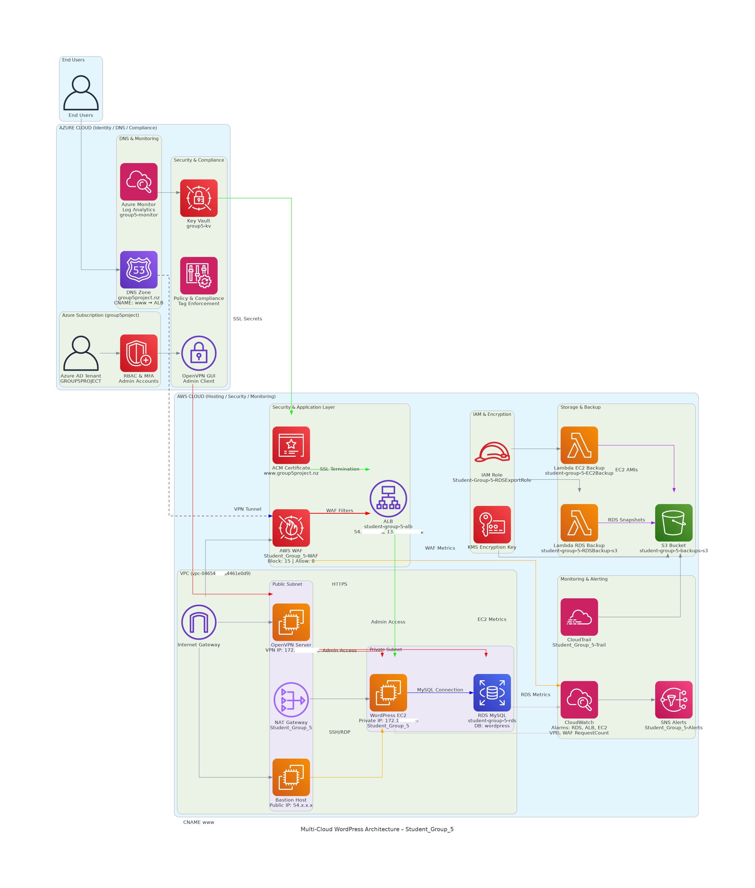

# Multi-Cloud-WordPress-Architecture
"Multi-cloud WordPress architecture deployed on AWS and Azure featuring WAF, ALB, Auto-scaling EC2, and private RDS with Azure AD integration."

**Edge Security:** AWS WAF + ALB for exploit mitigation.

**Identity:** Hybrid Azure AD integration via OpenVPN.

**Automation:** AWS Lambda for S3 backup orchestration.
